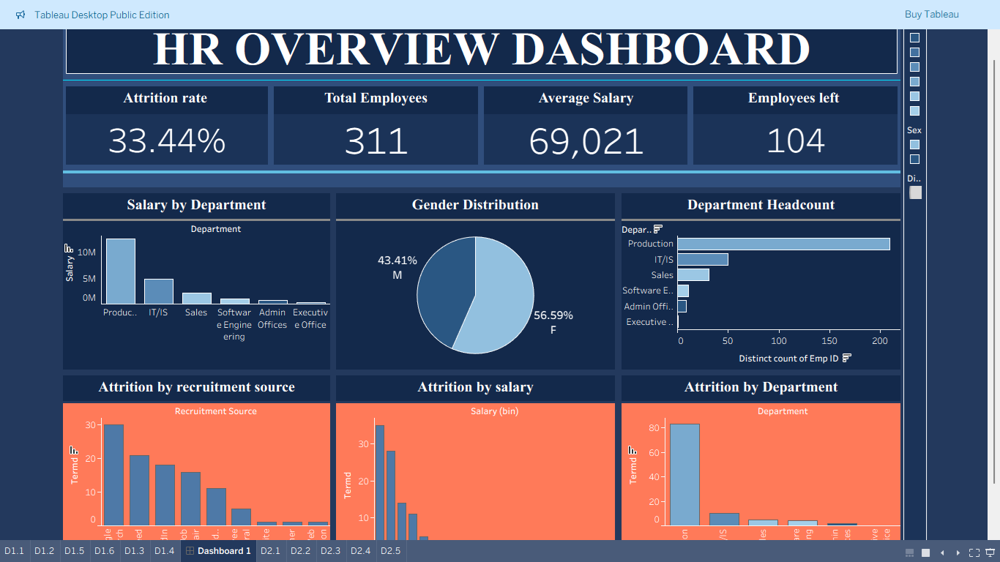

# HR Analytics Dashboard

## 📊 Project Overview
This Tableau project focuses on analyzing HR data to understand employee attrition, salary distribution, and workforce demographics. The dashboard provides insights into employee trends and helps organizations make data-driven HR decisions.

## 🎯 Objectives
- Analyze employee attrition rate
- Understand salary distribution across departments
- Identify key factors influencing employee turnover

## 🛠️ Tools Used
- Tableau
- Excel / CSV Dataset

## 📈 Key Insights
- High attrition rate observed in specific departments
- Salary variations across departments
- Gender distribution of employees
- Recruitment sources impacting attrition

## 📊 Dashboard Features
- Interactive filters and slicers
- Department-wise analysis
- Attrition trend visualization
- Clean and structured dashboard layout

## 📸 Dashboard Preview

## 🚀 Conclusion
This dashboard helps HR teams identify employee trends and take strategic actions to reduce attrition and improve workforce management.
